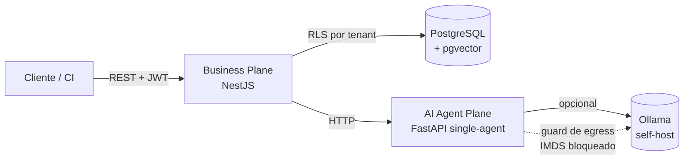

# Arquitetura (núcleo aberto)

## Estilo

API **headless** modular (NestJS) — a fonte da verdade de negócio (RBAC,
multi-tenant, domínio de Security Design Review) — com um **AI Agent Plane**
separado (FastAPI) para a revisão por IA, chamado por **HTTP** (`AGENTS_URL`).
Degradação honesta quando a IA não está disponível.

> O self-host de referência do núcleo aberto sobe **três serviços**: `postgres`,
> `api`, `agents`. Mensageria (RabbitMQ) e cache (Redis) são usados na operação
> Enterprise/SaaS, não no compose do núcleo.

## Módulos abertos

`auth` (identidade, RBAC, MFA), `tenants`, `projects`, `questionnaires` (maturidade),
`risks` (framework de risco), `requirements` (ASVS), `threat-modeling` (STRIDE +
sync ThreatAtlas), `reports`, `analytics`, `audit`, `metrics`, `health`, `ai`
(orquestração single-agent), `notifications` (event bus), `common` (tenant context,
primitivas de cripto/anti-SSRF).

## Multi-tenant por RLS

Isolamento por **PostgreSQL Row-Level Security**: as tabelas de negócio têm
`ENABLE/FORCE ROW LEVEL SECURITY` + política `tenant_isolation` usando o GUC
`app.current_tenant`. O runtime conecta com um role **não-superuser**
(`vantar_app`) sujeito ao RLS; o GUC é setado por requisição a partir do tenant do
JWT (via `typeorm-transactional`/CLS). Tabelas de auth (`users`, `tenants`,
`refresh_tokens`) ficam fora do RLS — login/refresh ocorrem sem contexto de tenant.

## AI Agent Plane (single-agent)

O núcleo aberto roda **um agente** com **um prompt básico**: uma chamada ao LLM
(via provider plugável — Ollama por padrão no self-host) com **fallback heurístico
STRIDE** quando o LLM não responde. Nada de "fingir" geração por IA — sem LLM, o
resultado vem da heurística e é rotulado como tal. Entradas (descrição/OpenAPI/
IaC) são sanitizadas antes do LLM. Detalhes em [IA](ai.md).

## Migrations & schema

Schema gerido por **migrations** forward-only (TypeORM; `synchronize` desligado).
Na subida: `migrate` → `seed` (idempotente) → servidor. Novas tabelas de negócio
recebem GRANT ao `vantar_app` + RLS.

## Supply chain & self-host

Imagens assinadas (**cosign** keyless) com **proveniência SLSA** no release.
Self-host de referência via Docker Compose — ver [Self-host](self-host.md).
