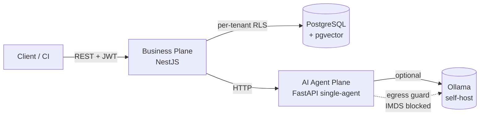

# Architecture (open core)

## Style

A modular **headless** API (NestJS) — the business source of truth (RBAC,
multi-tenancy, the Security Design Review domain) — with a separate **AI Agent
Plane** (FastAPI) for AI review, called over **HTTP** (`AGENTS_URL`). Honest
degradation when AI is unavailable.

> The reference self-host of the open core runs **three services**: `postgres`,
> `api`, `agents`. Messaging (RabbitMQ) and cache (Redis) are used in
> Enterprise/SaaS operation, not in the open-core compose.

## Open modules

`auth` (identity, RBAC, MFA), `tenants`, `projects`, `questionnaires` (maturity),
`risks` (risk framework), `requirements` (ASVS), `threat-modeling` (STRIDE +
ThreatAtlas sync), `reports`, `analytics`, `audit`, `metrics`, `health`, `ai`
(single-agent orchestration), `notifications` (event bus), `common` (tenant
context, crypto / anti-SSRF primitives).

## Multi-tenancy via RLS

Isolation through **PostgreSQL Row-Level Security**: business tables have
`ENABLE/FORCE ROW LEVEL SECURITY` + a `tenant_isolation` policy using the
`app.current_tenant` GUC. The runtime connects with a **non-superuser** role
(`vantar_app`) subject to RLS; the GUC is set per request from the JWT's tenant
(via `typeorm-transactional`/CLS). Auth tables (`users`, `tenants`,
`refresh_tokens`) sit outside RLS — login/refresh happen without a tenant context.

## AI Agent Plane (single-agent)

The open core runs **one agent** with a **basic prompt**: a single LLM call (via a
pluggable provider — Ollama by default for self-host) with a **STRIDE heuristic
fallback** when the LLM does not answer. No faking AI generation — with no LLM, the
result comes from the heuristic and is labeled as such. Inputs (description/
OpenAPI/IaC) are sanitized before the LLM. Details in [AI](ai.md).

## Migrations & schema

Schema managed by forward-only **migrations** (TypeORM; `synchronize` off). On
startup: `migrate` → `seed` (idempotent) → server. New business tables get a GRANT
to `vantar_app` + RLS.

## Supply chain & self-host

Images signed with **cosign** (keyless) and **SLSA provenance** on release.
Reference self-host via Docker Compose — see [Self-host](self-host.md).
